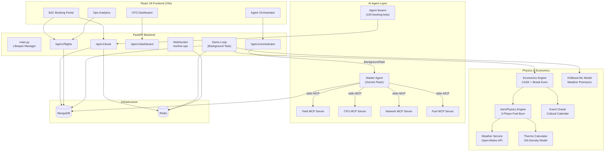

<div align="center">

# ✈️ FlySAND — Autonomous AI-Operated Airline Platform

**A fully AI‑managed, physics‑grounded, multi‑agent airline pricing & operations system**


</div>

---

## Table of Contents

1. [System Overview](#1-system-overview)
2. [Architecture](#2-architecture)
3. [Tech Stack](#3-tech-stack)
4. [Project Structure](#4-project-structure)
5. [Backend Deep Dive](#5-backend-deep-dive)
   - [5.1 FastAPI Core](#51-fastapi-core-appmainpy)
   - [5.2 Configuration](#52-configuration-appcoreconfig)
   - [5.3 MongoDB Manager](#53-mongodb--data-layer)
   - [5.4 Redis Bus & Locking](#54-redis-bus--distributed-locking)
   - [5.5 Physics Engine](#55-aerophysics-engine)
   - [5.6 Economics Engine](#56-economics-engine)
   - [5.7 Weather Service](#57-weather-service-open-meteo)
   - [5.8 Event Oracle](#58-event-oracle)
   - [5.9 API Routes](#59-api-routes)
   - [5.10 WebSocket Live-Ops](#510-websocket-live-ops)
   - [5.11 Game Loop](#511-game-loop-task)
6. [ML Pricing Model](#6-ml-pricing-model)
7. [Agent Architecture (MCP + Gemini)](#7-agent-architecture-mcp--gemini)
   - [7.1 Sub-Agents](#71-sub-agents)
   - [7.2 MCP Servers](#72-mcp-servers-fastmcp)
   - [7.3 Master Agent Orchestrator](#73-master-agent-orchestrator)
   - [7.4 Agent Swarm (Demand Simulator)](#74-agent-swarm-demand-simulator)
8. [Frontend Deep Dive](#8-frontend-deep-dive)
   - [8.1 B2C Booking Portal](#81-b2c-booking-portal)
   - [8.2 Ops Analytics Dashboard](#82-ops-analytics-dashboard)
   - [8.3 CFO Command Centre](#83-cfo-command-centre)
   - [8.4 Agent Orchestrator Dashboard](#84-agent-orchestrator-dashboard)
9. [Authentication Logic](#9-authentication-logic)
10. [Logging & Monitoring](#10-logging--monitoring)
11. [Setup & Run](#11-setup--run)
12. [Environment Variables](#12-environment-variables)

---

## 1. System Overview

FlySAND is a **self-sustaining, fully AI‑operated airline simulation platform** built on India's Golden Quadrilateral trunk routes (DEL ↔ BOM ↔ MAA ↔ CCU). It operates as a realistically-modelled low-cost carrier, where every component of airline operations — from ticket pricing to fuel procurement — is managed by AI agents coordinated through the **Model Context Protocol (MCP)**.

### What makes this unique

| Capability | Implementation |
|---|---|
| **Physics-derived cost floors** | Real atmospheric data (Open-Meteo) → thermodynamic density calculations → 3-phase fuel burn → break-even fare per seat |
| **ML dynamic pricing** | XGBoost model trained on market data, with weather-disruption premiums capped at 25% |
| **Multi-agent intelligence** | 4 Gemini-powered sub-agents (Yield, CFO, Network, Fuel) orchestrated by a Master Agent via MCP |
| **Real-world demand simulation** | 100-agent booking swarm with Poisson-paced bookings and 3-tier price sensitivity |
| **Event-driven pricing** | Bell-curve spike and plateau demand multipliers from a cultural calendar (Diwali, Durga Puja, summer holidays) |
| **Live operations** | WebSocket-powered real-time seat updates, Redis Pub/Sub event bus, distributed SETNX booking locks |

---

## 2. Architecture



### Data Flow

1. **Seeding** → Economics Engine computes physics-based cost floor per route → documents stored in MongoDB `live_flights`
2. **Booking** → Swarm agents POST to `/api/v1/book` → Redis lock → atomic `$inc` on inventory → `SEAT_SOLD` event published
3. **Repricing** → Game Loop subscribes to `WEATHER_SEVERE` channel → Economics Engine recalculates floor → ML model applies weather premium → MongoDB `$set` → `PRICE_UPDATE` event broadcast
4. **Agent Ensemble** → Master Agent spawns 4 MCP stdio processes → queries each sub-agent's tools → Gemini synthesises decisions → commits pricing changes to MongoDB

---

## 3. Tech Stack

### Backend
| Technology | Purpose |
|---|---|
| **Python 3.12** | Core runtime |
| **FastAPI** | Async REST API + WebSocket server |
| **Motor** | Async MongoDB driver |
| **redis.asyncio** | Async Redis client (Pub/Sub + SETNX locking) |
| **Pydantic v2** + **pydantic-settings** | Config management, request/response validation |
| **Uvicorn** | ASGI server |
| **XGBoost** | ML pricing model inference |
| **OpenAP** | Academic aircraft performance database |
| **Google GenAI SDK** | Gemini API for sub-agents and Master Agent |
| **MCP (Model Context Protocol)** | Agent↔tool communication via `FastMCP` servers and `stdio_client` |

### Frontend
| Technology | Purpose |
|---|---|
| **React 18** | UI framework |
| **Vite** | Build tool + dev server |
| **TypeScript** | Type safety |
| **Zustand** | Lightweight state management |
| **Lucide React** | Icon library |

### Infrastructure
| Technology | Purpose |
|---|---|
| **MongoDB** | Primary data store (live_flights, bookings) |
| **Redis** | Event bus (Pub/Sub) + distributed booking locks (SETNX) |
| **Docker** | Containerised MongoDB and Redis |

---

## 4. Project Structure

```
AeroSync-India/
├── backend/
│   ├── app/
│   │   ├── core/
│   │   │   ├── config.py          # Pydantic-settings singleton
│   │   │   ├── db.py              # Motor client lifecycle
│   │   │   └── redis_client.py    # SETNX locking + Pub/Sub bus
│   │   ├── engines/
│   │   │   ├── economics_engine.py  # Price floor recalculation
│   │   │   └── ml_pricing_model.py  # XGBoost inference + heuristic fallback
│   │   ├── services/
│   │   │   ├── economics_engine.py  # Full CASK model (31KB, 18 cost corrections)
│   │   │   ├── physics_engine.py    # 3-phase fuel burn (Climb/Cruise/Descent)
│   │   │   ├── physics_engine_math.py # Thermodynamic density calculator
│   │   │   ├── weather_service.py   # Open-Meteo API with ISA fallback
│   │   │   ├── event_oracle.py      # Bell-curve and plateau demand multipliers
│   │   │   ├── openap_service.py    # OpenAP aircraft specs lookup
│   │   │   ├── mongo_manager.py     # Seed/reprice/snapshot utilities
│   │   │   └── models.py           # Pydantic data models
│   │   ├── api/routes/
│   │   │   ├── booking.py          # POST /api/v1/book (atomic, Redis-locked)
│   │   │   ├── flights.py          # GET /api/v1/flights (filtered read)
│   │   │   ├── dashboard.py        # GET /api/v1/dashboard (CFO analytics)
│   │   │   └── orchestrator.py     # POST/GET orchestrator API
│   │   ├── tasks/
│   │   │   └── game_loop.py        # WEATHER_SEVERE → reprice pipeline
│   │   ├── websockets/
│   │   │   └── live_ops.py         # WebSocket real-time seat broadcast
│   │   └── main.py                 # FastAPI app factory + lifespan
│   │
│   ├── agents/
│   │   ├── swarm.py                # 100-agent demand simulator
│   │   ├── yield_manager.py        # AI Yield Manager (standalone)
│   │   ├── cfo_narrator.py         # CFO Narrator agent
│   │   ├── network_planner.py      # Network Planning agent
│   │   ├── fuel_procurement.py     # Fuel Procurement agent
│   │   ├── finance_controller.py   # Finance controller
│   │   └── disruption_coordinator.py # Disruption management
│   │
│   ├── mcp_servers/
│   │   ├── yield_manager_mcp.py    # FastMCP bridge: Yield → Gemini tool
│   │   ├── cfo_narrator_mcp.py     # FastMCP bridge: CFO → Gemini tool
│   │   ├── network_planner_mcp.py  # FastMCP bridge: Network → Gemini tool
│   │   └── fuel_procurement_mcp.py # FastMCP bridge: Fuel → Gemini tool
│   │
│   ├── master_agent.py             # Gemini Master Agent orchestrator
│   └── agent_logs/                 # Per-agent markdown logs
│
├── ml_pricing/
│   ├── data_fusion.py              # Kaggle dataset cleaner + economics fuser
│   ├── demand_model.py             # Demand curve modelling
│   ├── train_xgb.py               # Chronological XGBoost trainer
│   ├── train_pipeline.py          # Full training pipeline
│   ├── inference.py               # Margin-enforced prediction wrapper
│   ├── economics_engine.py        # Standalone economics for training
│   └── artifacts/                 # Trained model + scaler + feature metadata
│
├── src/                           # React TypeScript frontend
│   ├── components/
│   │   ├── b2c/                   # Booking portal (Nav, Search, Results, Seat, Pay)
│   │   ├── b2b/                   # CFO dashboard (Header, Login, Dashboard)
│   │   ├── ops/                   # Ops analytics (Flights page, Agent Orchestrator)
│   │   ├── shared/                # Reusable components
│   │   └── UnifiedLogin.tsx       # Merged login with credential-based routing
│   ├── store/                     # Zustand stores
│   ├── constants/                 # Airport codes, credentials, routes
│   ├── types/                     # TypeScript interfaces
│   └── utils/                     # Formatting helpers
│
└── docker-compose.yml             # MongoDB + Redis containers
```

---

## 5. Backend Deep Dive

### 5.1 FastAPI Core (`app/main.py`)

The application uses FastAPI's **lifespan context manager** pattern (replacing deprecated `on_event`):

```
Startup Sequence:
  1. connect_mongo()       → Motor client + health ping
  2. create_task(start_game_loop())  → Redis Pub/Sub daemon
  3. yield                 → Application live, accepting requests

Shutdown Sequence:
  1. Cancel game_loop task → Clean PubSub unsubscribe
  2. close_mongo()         → Graceful Motor teardown
```

**Router Mounting:**
| Prefix | Router | Purpose |
|---|---|---|
| `/api/v1` | `booking_router` | Seat booking (POST) |
| `/api/v1` | `flights_router` | Flight queries (GET) |
| `/api/v1` | `dashboard_router` | CFO analytics (GET) |
| `/api/v1/orchestrator` | `orchestrator_router` | Agent ensemble trigger/status/logs |
| `/ws/live-ops` | `ws_router` | Real-time seat updates |
| `/health` | inline | Liveness probe |

CORS is configured via `settings.CORS_ORIGINS` (default: `localhost:3000`, `localhost:5173`).

---

### 5.2 Configuration (`app/core/config`)

Uses **pydantic-settings v2** with a singleton pattern:

```python
from app.core.config import settings
```

| Variable | Type | Purpose |
|---|---|---|
| `MONGO_URI` | str | Motor connection string |
| `MONGO_DB` | str | Target database name (`flight_ops`) |
| `REDIS_URI` | str | Redis connection URL |
| `REDIS_BROADCAST_CHANNEL` | str | Pub/Sub channel for `SEAT_SOLD`, `PRICE_UPDATE`, `DISRUPTION_ALERT` |
| `REDIS_CHANNEL_WEATHER_SEVERE` | str | Dedicated channel for weather events |
| `REDIS_LOCK_TTL_SECONDS` | int | SETNX lock expiry (default: 5s) |
| `CORS_ORIGINS` | list[str] | Allowed CORS origins |

**Precedence:** Environment vars > `.env` file > field defaults.

---

### 5.3 MongoDB & Data Layer

**Collections:**

| Collection | Schema | Purpose |
|---|---|---|
| `live_flights` | `_id` = flight_id, `origin`, `destination`, `departure_date`, `inventory`, `current_pricing`, `physics_snapshot` | Live flight inventory (1,080 docs for 30-day horizon) |
| `bookings` | `booking_ref`, `flight_id`, `passenger_id`, `seats_booked`, `price_charged_inr`, `idempotency_key` | Booking records |

**Flight Document Structure (simplified):**
```json
{
  "_id": "6E-DEL_A_2026-04-15",
  "origin": "DEL",
  "destination": "BOM",
  "departure_date": "2026-04-15",
  "slot": "A",
  "status": "scheduled",
  "inventory": { "capacity": 186, "sold": 42, "available": 144 },
  "current_pricing": { "ml_fare_inr": 5230.0, "floor_inr": 4820.0 },
  "physics_snapshot": { "total_fuel_burn_kg": 3412.5, "block_time_hrs": 2.14 }
}
```

The `_id` format encodes `airline-route_slot_date` for deterministic upserts. Compound index on `(origin, destination, departure_date, status)` guarantees sub-10ms reads.

---

### 5.4 Redis Bus & Distributed Locking

**File:** `app/core/redis_client.py`

Three concerns wrapped in one module:

#### Connection Pooling
- Single `ConnectionPool` per process, lazy-initialised
- `max_connections=200` (scaled for the 100-agent swarm + game loop + WebSocket)

#### SETNX Distributed Booking Lock
```
acquire_lock("lock:booking:6E-DEL_A_2026-04-15", ttl=5)
→ SET key "1" NX EX 5   (atomic, avoids SETNX + EXPIRE race)
→ True = proceed with booking
→ False = HTTP 409 LOCK_CONTENTION, client retries
```
Lock is always released in a `finally` block, and the TTL ensures a crashed process never holds a lock forever.

#### Pub/Sub Event Bus

Three event types flow through the bus:

| Event | Channel | Publisher | Subscriber |
|---|---|---|---|
| `SEAT_SOLD` | `live_ops_broadcast` | booking.py | live_ops.py (WebSocket) |
| `PRICE_UPDATE` | `live_ops_broadcast` | game_loop.py | live_ops.py (WebSocket) |
| `WEATHER_SEVERE` | `weather_severe` | external trigger | game_loop.py |

Each subscriber gets a **dedicated** Redis connection (not from the pool) so that blocking `listen()` never starves booking traffic.

---

### 5.5 AeroPhysics Engine

**File:** `app/services/physics_engine.py` + `physics_engine_math.py`

A thermodynamics-grounded fuel burn calculator that models **real aerodynamic physics** to derive cost floors.

#### Three-Phase Fuel Burn Model

Instead of a flat hourly burn rate, flights are broken into aerodynamically distinct phases:

| Phase | Duration | Burn Multiplier | Physics |
|---|---|---|---|
| **Climb** | ~20 min (130 km) | 1.85× base | Engines at max thrust against gravity |
| **Cruise** | Dynamic | 1.0× base × weather multipliers | Steady-state, adjusted for headwinds |
| **Descent** | ~25 min (160 km) | 0.35× base | Near-idle thrust, gravity-assisted |

**Weather adjustments** are only applied to Climb and Cruise; Descent is gravity-driven.

#### Thermodynamic Density Calculator (`ThermodynamicCalculator`)

Translates real weather data into aerodynamic penalties:

1. **Density Ratio** — Tetens equation for vapour pressure → actual air density `ρ` vs ISA standard (`1.225 kg/m³`). Hot, humid air = lower density = higher fuel burn.
2. **Kinematic Winds** — Jet stream headwind subtracts from TAS (830 km/h cruise) → slower ground speed → longer flight time.
3. **Chaos Multipliers:**
   - Icing risk → +12% fuel burn + 15 min ATC holding
   - CAPE > 1000 (thunderstorms) → +5% fuel burn + 10 min holding
   - Heavy precipitation > 5mm → +15 min holding

#### Base Burn Rates (kg/hr)
| Aircraft | ICAO | Burn Rate | Pax Capacity |
|---|---|---|---|
| A320neo | A20N | 1,989 | 186 |
| A321neo | A21N | 2,323 | 222 |
| A320ceo | A320 | 2,326 | 180 |
| ATR 72 | AT72 | 800 | 78 |

---

### 5.6 Economics Engine

**File:** `app/services/economics_engine.py` (31 KB, 589 lines)

The most complex module in the system. Computes the **Cost per Available Seat Kilometre (CASK)** and break-even fare for every flight using 18 individually audited cost components.

#### Cost Components

| # | Category | Source | Example |
|---|---|---|---|
| 1 | **Fuel (ATF)** | Physics Engine output × ATF price/kg | ₹92.81/kg (Indian Aviation Turbine Fuel) |
| 2 | **ATC Navigation** | ICAO formula: `SU × ₹5,180` where `SU = √(distance/100) × √(MTOW/50)` | Route-specific |
| 3 | **Landing Fee** | Airport tariff dict (₹/ton MTOW) | DEL: ₹1,670, BOM: ₹1,990, MAA: ₹1,540, CCU: ₹1,290 |
| 4 | **Ground Handling** | Airport-specific flat rate | DEL: ₹68K, BOM: ₹74K per turn |
| 5 | **Maintenance** | ₹42,000/block-hour (CAPA A320neo PBH benchmark) | Time-based |
| 6 | **Crew** | ₹20,500/block-hour (inclusive of training amortisation) | Time-based |
| 7 | **Lease** | ₹80,000/block-hour (post-2022 market rates) | Time-based |
| 8 | **Insurance** | ₹3,800/block-hour (hull + liability split) | Time-based |
| 9 | **Catering** | ₹14,000/departure (buy-on-board galley) | Per-departure |
| 10 | **CUTE/CUSS IT** | ₹4,500/departure (airport IT systems) | Per-departure |
| 11 | **Overflying** | Route-specific (Pakistan/Bangladesh airspace) | Variable |
| 12 | **Belly Cargo Credit** | −₹0.40/ASK (IndiGo belly cargo revenue offset) | Reduces cost |
| 13 | **OTA/Distribution** | ₹180/pax (blended channel cost) | Per-passenger |
| 14 | **IOC Markup** | 8% (indirect operating costs) | Percentage |
| 15 | **Profit Margin** | 13.5% base | Percentage |
| 16 | **DOW Multiplier** | Day-of-week pricing curves | 0.92× – 1.15× |
| 17 | **Early-Bird Discount** | Up to 12% discount for >21 days out | Time-based |
| 18 | **Event Demand** | Event Oracle multiplier (max 3.5×) | Calendar-based |

#### Break-Even Calculation
```
paying_pax = capacity × load_factor   (LF = 85.6%, IndiGo FY25)
total_cost = fuel + ATC + landing + ground + maintenance + crew + lease + ...
break_even_per_seat = total_cost / paying_pax
floor_inr = break_even_per_seat × (1 + profit_margin)
ml_fare_inr = floor × DOW_multiplier × event_multiplier − early_bird_discount
```

**Cardinal Rule:** `ml_fare_inr >= floor_inr` is enforced at every pricing layer.

---

### 5.7 Weather Service (Open-Meteo)

**File:** `app/services/weather_service.py`

Fetches real atmospheric data from the free [Open-Meteo API](https://open-meteo.com):

- **≤14 days out** → `/v1/forecast` endpoint (16-day forecast)
- **>14 days out** → `/v1/archive` endpoint (historical same-day from last year)

**Caching:** Results are keyed on `(destination_IATA, days_to_flight)`. The seeder generates 1,080 flights but only 120 unique weather combinations exist (4 destinations × 30 days). Cache collapses API calls by **~88%**.

**ISA Fallback:** If the API fails, returns standard International Standard Atmosphere values: 15°C, 1013.25 hPa, 60% humidity, 50 kph jet stream.

**Atmospheric Profile Output:**
```json
{
  "surface_thermodynamics": { "temp_c": 35.0, "pressure_hpa": 1005.0, "humidity_percent": 75.0 },
  "cruise_atmosphere": { "jet_stream_headwind_kph": 147.5, "temp_250hPa_c": -33.0 },
  "chaos_factors": { "cape_instability": 1500.0, "precipitation_mm": 12.0, "icing_risk_critical": false }
}
```

---

### 5.8 Event Oracle

**File:** `app/services/event_oracle.py`

A demand-curve engine driven by `events_master.json` — a hand-curated cultural calendar of Indian events affecting air travel.

#### Two Demand Curve Types

**Spike Events** (e.g., Diwali, Durga Puja):
- Bell-curve (Gaussian) decay from peak date
- `σ` set so premium drops to ~10% of peak at window edge
- Supports asymmetric pre/post-peak multipliers (e.g., higher outbound demand pre-Diwali, higher return post-Diwali)

**Plateau Events** (e.g., Summer Vacation):
- Flat multiplier applied for the entire seasonal window
- Route-specific overrides available

#### Compounding & Safety
- Multiple overlapping events are **compounded** (multiplied)
- Hard cap of **3.5×** prevents runaway pricing

---

### 5.9 API Routes

#### `POST /api/v1/book` — Atomic Seat Booking

The critical path for every booking:

```
1. acquire_lock("lock:booking:{flight_id}", ttl=5)
   → 409 LOCK_CONTENTION if already held

2. Idempotency check → lookup bookings collection by idempotency_key
   → If found, return original booking (no inventory change)

3. findOneAndUpdate with filter:
   { _id: flight_id, "inventory.available": { $gte: seats }, status: "scheduled" }
   update: { $inc: { "inventory.available": -N, "inventory.sold": +N } }
   → 404 if flight not found
   → 422 if insufficient seats

4. Insert booking document into `bookings` collection

5. Publish SEAT_SOLD event to Redis broadcast channel

6. Release lock (always, via finally block)
```

#### `GET /api/v1/flights` — Live Flight Query

Supports optional query params: `origin`, `destination`, `departure_date` — all ANDed. Returns array of flight documents with `_id` renamed to `flight_id` for frontend consumption.

#### `GET /api/v1/dashboard/*` — CFO Analytics

Provides aggregated analytics: revenue by route, load factor distribution, top-performing flights, fleet utilisation metrics.

#### Orchestrator API (`/api/v1/orchestrator`)

| Endpoint | Method | Purpose |
|---|---|---|
| `/run` | POST | Triggers full agent ensemble as a FastAPI `BackgroundTask` |
| `/status` | GET | Returns per-agent JSON status (idle/initializing/queried/responded/error) |
| `/logs` | GET | Returns all master agent log files |
| `/logs/{agent}` | GET | Returns per-agent log files (yield, cfo, network, fuel, master) |

---

### 5.10 WebSocket Live-Ops

**File:** `app/websockets/live_ops.py`

Bridges Redis Pub/Sub → WebSocket for real-time frontend updates:
- Subscribes to `REDIS_BROADCAST_CHANNEL`
- Forwards `SEAT_SOLD` and `PRICE_UPDATE` events to all connected WebSocket clients
- Each WebSocket connection gets its own Redis Pub/Sub connection (prevents blocking)

---

### 5.11 Game Loop Task

**File:** `app/tasks/game_loop.py`

A background daemon that reacts to weather disruptions in real-time:

```
Event: WEATHER_SEVERE on Redis channel
  │
  ├── For each affected_flight_id:
  │   ├── 1. Fetch flight document from MongoDB
  │   ├── 2. recalculate_floor() → new cost floor with regional risk premium
  │   ├── 3. predict_price() → ML model applies weather premium (max +25%)
  │   ├── 4. final_price = max(ml_price, floor)  ← Cardinal Rule
  │   ├── 5. Atomic $set to MongoDB
  │   └── 6. Publish PRICE_UPDATE to broadcast channel
  │
  └── Auto-reconnects on Redis failures (3s delay)
```

Each handler runs as a separate `asyncio.create_task` so slow repricing never blocks the subscription loop.

---

## 6. ML Pricing Model

**Directory:** `ml_pricing/`

### Pipeline Architecture

```
ml_pricing/
├── data_fusion.py      │ Step 1: Kaggle flight data → cleaned, label-encoded
├── demand_model.py     │ Step 2: Demand curve parameters + price elasticity
├── economics_engine.py │ Step 3: Cost floors for training labels
├── train_xgb.py        │ Step 4: Chronological train/test split → XGBoost
├── inference.py        │ Step 5: Production inference with margin enforcement
└── artifacts/
    ├── xgb_indigo_pricing.ubj   │ Trained XGBoost model (binary)
    ├── feature_scaler.pkl       │ Fitted StandardScaler
    └── feature_names.json       │ Feature list + validation metrics
```

### Feature Vector (15 features)

| # | Feature | Source |
|---|---|---|
| 1 | `days_to_departure` | Calendar computation |
| 2 | `dep_hour` | Departure slot → hour mapping (A=6, B=12, C=18) |
| 3 | `booking_window_bucket` | `min(days/10, 4)` — 0 to 4 scale |
| 4 | `likely_weekend` | Whether departure hour ≥ 17 (Friday evening) |
| 5 | `is_morning_rush` | 05:00–09:59 |
| 6 | `is_midday` | 10:00–16:59 |
| 7 | `is_red_eye` | 17:00–04:59 |
| 8 | `is_golden_quad` | Routes within DEL/BOM/MAA/CCU |
| 9 | `stops_numeric` | 0 for non-stop |
| 10 | `duration_minutes` | Block time in minutes |
| 11 | `simulated_base_cost_inr` | Economics engine floor price |
| 12 | `event_demand_multiplier` | Event Oracle output |
| 13–15 | One-hot route encoding | Categorical features |

### Inference Logic

```python
def predict_price(...):
    base = current_price if current_price > floor else floor
    load_factor = 1.0 - (seats_available / total_seats)

    if xgboost_model_available:
        ml_ratio = exp(model.predict(features)) - 1
        weather_premium = min(max(0, ml_ratio - 1.0) * severity, 0.25)
    else:
        # Heuristic fallback
        weather_premium = min(severity * 0.18 + load_factor * severity * 0.10, 0.25)

    final = max(base * (1 + weather_premium), floor * 1.02)
```

**Key design decision:** The ML model does NOT reprice from scratch. It adds a **weather disruption premium** (0–25%) on top of the already-calibrated seeded price. This prevents absurd outputs from model drift.

---

## 7. Agent Architecture (MCP + Gemini)

### 7.1 Sub-Agents

| Agent | File | Gemini Key | Intelligence Domain |
|---|---|---|---|
| **Yield Manager** | `agents/yield_manager.py` | `GEMINI_API_KEY_YIELD` | Revenue optimisation — RAISE/LOWER/HOLD/FLOOR decisions per flight |
| **CFO Narrator** | `agents/cfo_narrator.py` | `GEMINI_API_KEY_CFO` | Financial briefings — P&L analysis, margin health |
| **Network Planner** | `agents/network_planner.py` | `GEMINI_API_KEY_NETWORK` | Route optimisation — frequency, capacity allocation |
| **Fuel Procurement** | `agents/fuel_procurement.py` | `GEMINI_API_KEY_FUEL` | Fuel hedging — ATF price sensitivity, tankering |

#### Yield Manager Decision Logic

The Yield Manager is the most critical agent. It receives a structured brief containing:
- Flight ID, route, days-to-departure, route type (Business/Leisure)
- Load factor, current fare, floor price, fare-to-floor ratio, cap price

**Hard Constraints (Gemini cannot override):**
- `new_fare >= floor_inr` (cardinal rule)
- `new_fare <= floor_inr × 1.40` (strategy cap — win by volume, not margin)
- Max ±20% change per pricing cycle
- Flights departing in <2 hours: read-only

---

### 7.2 MCP Servers (FastMCP)

Each sub-agent is wrapped as a **stateless FastMCP server** that exposes intelligence as callable tools:

| MCP Server | Tool Exposed | What It Does |
|---|---|---|
| `yield_manager_mcp.py` | `evaluate_route_yields` | Pulls flights from MongoDB → builds brief → Gemini analysis → returns pricing decisions |
| `cfo_narrator_mcp.py` | `draft_financial_brief` | Aggregates revenue data → Gemini drafts executive summary |
| `network_planner_mcp.py` | `plan_network` | Analyses route performance → Gemini suggests network changes |
| `fuel_procurement_mcp.py` | `optimize_fuel` | Analyses fuel consumption patterns → Gemini suggests procurement strategy |

**Communication protocol:** Each MCP server runs as a child process. The Master Agent communicates with them via **stdio** (stdin/stdout) using the MCP client protocol. This keeps each agent stateless and crash-isolated.

---

### 7.3 Master Agent Orchestrator

**File:** `backend/master_agent.py`

The brain of the system. Uses Google Gemini to coordinate all 4 sub-agents:

```
1. AsyncExitStack spawns 4 MCP stdio processes concurrently
2. Each session is initialised via MCP protocol handshake
3. Master Agent collects all available tools from all sessions
4. Gemini receives the combined tool catalog + a system prompt
5. Gemini decides which tools to call, in what order
6. Tool calls are routed to the correct MCP session via AGENT_TOOL_MAP
7. Responses are collected and Gemini synthesises a final decision
8. Approved pricing changes are committed to MongoDB via $set + $push
9. Pricing history is appended for audit trail
```

**Status Callback:** The Master Agent accepts an optional `status_callback` function that writes per-agent status updates to `agent_logs/agent_status.json`. This powers the real-time KPI cards on the orchestrator dashboard.

**Per-Agent Logging:** Each sub-agent's input/output is written to timestamped markdown files: `yield_log_20260327_103000.md`, etc.

---

### 7.4 Agent Swarm (Demand Simulator)

**File:** `agents/swarm.py` (559 lines)

Simulates realistic passenger demand using 100 concurrent asyncio coroutines:

#### Price Sensitivity Tiers

| Tier | % of Agents | Price Ceiling | Behaviour |
|---|---|---|---|
| Budget Students | 40% | ₹4,500 | Only books if fare < ceiling; skips expensive flights |
| Mid-Range Leisure | 35% | ₹7,000 | Books most flights; skips peak-priced ones |
| Price-Insensitive Business | 25% | ₹15,000 | Always books regardless of price |

#### Pacing (Poisson Distribution)

| Days to Departure | Mean Sleep Interval | Booking Pace |
|---|---|---|
| > 21 days | 180–480 sec | 1 attempt per 3–8 min |
| 7–21 days | 60–180 sec | 1 attempt per 1–3 min |
| 3–7 days | 20–60 sec | 1 attempt every 20–60 sec |
| < 3 days | 5–20 sec | Near-real-time panic bookings |

**Additional realism:**
- 30% random skip chance for organic irregularity
- 1 seat per booking (students don't bulk-book)
- Lock contention (HTTP 409) → short back-off, not crash
- Shared `aiohttp.ClientSession` for connection pooling

---

## 8. Frontend Deep Dive

### 8.1 B2C Booking Portal

The passenger-facing interface at `localhost:5173`:

| Component | File | Purpose |
|---|---|---|
| `B2CNav` | `b2c/B2CNav.tsx` | Dark navbar with FlySAND logo, "AI OPERATED" badge, "CREW LOGIN" button |
| `B2CPortal` | `b2c/B2CPortal.tsx` | Main layout wrapper |
| `SearchForm` | `b2c/SearchForm.tsx` | Origin/destination selectors with airport autocomplete |
| `FlightResults` | `b2c/FlightResults.tsx` | Real-time flight cards with ML pricing and seat availability |
| `SeatSelectionPage` | `b2c/SeatSelectionPage.tsx` | Interactive seat map (A320neo, 186 seats) |
| `PaymentPage` | `b2c/PaymentPage.tsx` | Payment flow with fare breakdown |

### 8.2 Ops Analytics Dashboard

**File:** `ops/OpsFlightsPage.tsx`

Full flight inventory table with:
- **Summary KPI cards**: Total flights, total seats sold, system load factor, average fare
- **Filter toolbar**: Origin, destination, status filters + Refresh button
- **Pagination**: Show [10/25/50/100/250] per page with ◀▶ navigation and "1–25 of 576" counter
- **Sortable columns**: Click any column header to sort (date, route, load factor, fare)
- **Status indicators**: Color-coded badges for scheduled/boarding/departed/cancelled
- **FlySAND branding**: Dark `#0A1628` header matching B2C portal

### 8.3 CFO Command Centre

**File:** `b2b/AOCCDashboard.tsx`

Executive intelligence dashboard with:
- Revenue metrics, margin analysis, fleet utilisation
- Route-level P&L cards
- Agent-generated financial briefings

### 8.4 Agent Orchestrator Dashboard

**File:** `ops/AgentOrchestratorPage.tsx`

Real-time monitoring of the AI agent ensemble:
- **4 KPI cards** (Yield, CFO, Network, Fuel) with live status indicators (IDLE/INITIALIZING/QUERIED/RESPONDED/ERROR)
- **Master terminal** — dark terminal aesthetic showing master agent logs
- **Per-agent log sidebar** — toggle between agent-specific logs
- **Execute button** — triggers `POST /api/v1/orchestrator/run`

---

## 9. Authentication Logic

**File:** `src/components/UnifiedLogin.tsx`

A single unified login page that routes users to different dashboards based on credentials:

```
┌─────────────────────────────────┐
│       FlySAND Crew Login        │
│                                 │
│  Username: [____________]       │
│  Password: [____________]       │
│                                 │
│        [Sign In →]              │
│                                 │
│  OPS: ops/ops@123               │
│  CFO: AOCC_OPS/6E_TERMINAL     │
└─────────────────────────────────┘
```

| Credentials | Route Target | Dashboard |
|---|---|---|
| `ops` / `ops@123` | `→ ops-flights` | Ops Analytics (flight inventory, pricing table) |
| `AOCC_OPS` / `6E_TERMINAL` | `→ aocc` | CFO Command Centre (financial intelligence) |

**Implementation details:**
- Frontend-only auth (credentials defined in `src/constants/index.ts`)
- `OPS_CREDENTIALS` uses direct view navigation via `useNavStore`
- `AOCC_CREDENTIALS` additionally calls `useAuthStore.login()` which sets `authenticated: true` and stores `operatorId` — this gates the AOCC dashboard (App.tsx resolves `"aocc"` view to `"login"` if not authenticated)
- The B2C booking portal is **public** — no login required

---

## 10. Logging & Monitoring

### Backend Logging

All backend modules use Python's `logging` module with a structured format:
```
2026-03-27 10:30:15 [INFO] orchestrator.booking — SEAT_SOLD published — flight=6E-DEL_A_2026-04-15 ref=BK-A1B2C3 seats_remaining=142
```

Logger namespaces:
| Logger | Module |
|---|---|
| `orchestrator.main` | Application lifecycle |
| `orchestrator.booking` | Booking endpoint |
| `orchestrator.flights` | Flight queries |
| `orchestrator.redis` | Redis pool + lock events |
| `orchestrator.game_loop` | Weather repricing pipeline |
| `orchestrator.economics` | Floor recalculation |
| `orchestrator.ml` | XGBoost inference |
| `aerosync.swarm` | Booking agent swarm |
| `mcp.master` | Master Agent orchestrator |
| `mcp.yield_mgr` | Yield MCP server |

### Per-Agent Markdown Logs

The Master Agent writes structured markdown logs for each sub-agent execution:

```
backend/agent_logs/
├── master_log_20260327_103000.md    ← Full orchestration transcript
├── yield_log_20260327_103005.md     ← Yield Manager's analysis + decisions
├── cfo_log_20260327_103010.md       ← CFO financial brief
├── network_log_20260327_103015.md   ← Network planning suggestions
├── fuel_log_20260327_103020.md      ← Fuel procurement analysis
└── agent_status.json                ← Real-time per-agent status (read by frontend)
```

### `agent_status.json`

This file is the bridge between the backend agent execution and the frontend orchestrator dashboard:

```json
{
  "master": { "status": "running", "last_run": "2026-03-27T10:30:00" },
  "yield":  { "status": "responded", "last_run": "2026-03-27T10:30:05", "last_result": "..." },
  "cfo":    { "status": "queried", "last_run": null, "last_result": null },
  "network": { "status": "idle", "last_run": null, "last_result": null },
  "fuel":   { "status": "idle", "last_run": null, "last_result": null }
}
```

---

## 11. Setup & Run

### Prerequisites

- **Python 3.12+** with virtual environment
- **Node.js 18+** with npm
- **Docker** (for MongoDB and Redis)
- **Gemini API keys** (5 keys for free-tier parallel usage)

### Step 1: Infrastructure

```bash
# Start MongoDB
docker run -d --name mongo -p 27017:27017 mongo:7

# Start Redis
docker run -d --name redis -p 6379:6379 redis:7-alpine
```

### Step 2: Backend

```bash
cd backend
python -m venv .venv
.venv\Scripts\activate          # Windows
pip install -r requirements.txt

# Seed flight data (runs physics + economics engine for all routes × 30 days)
python -m app.services.mongo_manager

# Start the API server
uvicorn app.main:app --reload --port 8000
```

### Step 3: Frontend

```bash
cd ..   # back to repo root
npm install
npm run dev
```

### Step 4: Agent Swarm (Optional — Demand Simulation)

```bash
cd backend
python -m agents.swarm
```

### Step 5: Agent Ensemble (Optional — AI Pricing)

Trigger via the UI ("Execute Full Ensemble" button on the Orchestrator page) or via API:
```bash
curl -X POST http://localhost:8000/api/v1/orchestrator/run
```

---

## 12. Environment Variables

Create `backend/.env` with:

```env
# ── Database ──
MONGO_URI=mongodb://localhost:27017
MONGO_DB=flight_ops

# ── Redis ──
REDIS_URI=redis://localhost:6379/0
REDIS_BROADCAST_CHANNEL=live_ops_broadcast
REDIS_CHANNEL_WEATHER_SEVERE=weather_severe
REDIS_LOCK_TTL_SECONDS=5

# ── CORS ──
CORS_ORIGINS=["http://localhost:5173","http://localhost:3000"]

# ── Gemini API Keys (5 distinct keys for free-tier parallel calls) ──
GEMINI_API_KEY=<master-agent-key>
GEMINI_API_KEY_YIELD=<yield-agent-key>
GEMINI_API_KEY_CFO=<cfo-agent-key>
GEMINI_API_KEY_NETWORK=<network-agent-key>
GEMINI_API_KEY_FUEL=<fuel-agent-key>
```

> **Why 5 keys?** Gemini free tier has per-key rate limits. Using separate keys for each sub-agent and the master ensures the ensemble can run all 4 MCP servers concurrently without hitting quota.

---

<div align="center">

**Built with ❤️ by FlySAND — Where AI Flies the Airline**

</div>
